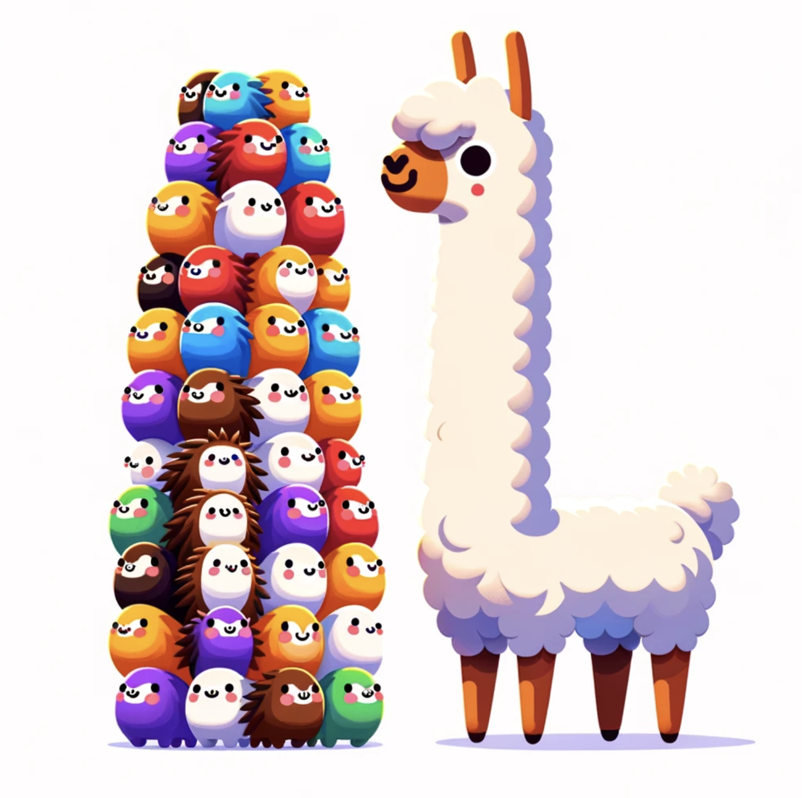

# LoLCATs

<p align="center">

</p>

We're excited to share LoLCATs, a new method to *convert* existing Transformers like Llamas & Mistrals into state-of-the-art subquadratic LLMs. 

LoLCATs does two things:
1. Attention Transfer: We replace the softmax attentions of an existing Transformer with linear attention analogs, but first *train* these linear layers to approximate their softmax counterparts
2. Low-rank Linearizing: Then, we can simply adjust for any approximation errors & recover quality with low-rank adaptation

We find this "**Lo**w-rank **L**inear **C**onversion via **A**ttention **T**ran**s**fer" (hence, LoLCATs) results in "linearizing" LLMs with state-of-the-art quality and training efficiency (taking a couple hours on one 40GB A100 to create subquadratic Llama 3 8B and Mistral 7B LLMs). 

With this repo, we hope you can too! 

In this README:

- Getting started with dependencies, installation, and experiment configs
- Sample commands for 7B+ LLMs (e.g., Mistral-7B-v0.1, Llama-3-8B, Llama-3.1-8B; anything you can run on a single GPU)

---

## Getting started

### Setup dependencies

Please see `environment.yaml` for dependencies and adjust PyTorch CUDA version if needed. We can set them up with conda:

```
conda env create -f environment.yaml
conda activate lolcats-env
```

---

### Experiment and model configs

We organize things under experiment and model config files (`.yaml`) in `./configs`.

- Files under `./configs/experiments/` determine dataset and training hyperparameters (for training attentions, for low-rank adaptation).
- Files under `./configs/models/` determine model setup (pretrained LLM, linear attention architecture)

For models, our scripts should automatically download the models from Hugging Face, but you should change the `cache_dir` to reflect where you want to save the weights.

For example:

```yaml
pretrained_config:
  pretrained_model_name_or_path: "mistralai/Mistral-7B-v0.1"
  cache_dir: "/models/mistral-7b-v0.1" # change this
  return_dict: true
  quantization: false
  device_map: auto
  low_cpu_mem_usage: true
  torch_dtype: bfloat16
  rope_theta: 10000.0
  attn_implementation: flash_attention_2  # set to eager if you also want to compute attention weights
```

---

### Additional dependencies

#### Flash Attention 2 install

To do attention transfer, we train linear attentions by first computing softmax attention outputs as ``ground-truth'' targets to match. To compute these outputs with Flash Attention 2 (FA2), we recommend following Tri's default instructions [here](https://github.com/Dao-AILab/flash-attention?tab=readme-ov-file#installation-and-features).

Copying those instructions here: (1) Have `packaging` installed (`pip install packaging`). (2) Have `ninja` installed and working correctly (`ninja --version` then `echo $?` should return exit code 0). Otherwise reinstall with `pip uninstall -y ninja && pip install ninja`. (3) Install FA2 with

```
pip install flash-attn --no-build-isolation
```

---


#### Causal linear attention CUDA kernel

We support a faster causal linear attention with the CUDA kernel from [https://github.com/idiap/fast-transformers/tree/master](https://github.com/idiap/fast-transformers/tree/master), citing:

```
@inproceedings{katharopoulos_et_al_2020,
    author = {Katharopoulos, A. and Vyas, A. and Pappas, N. and Fleuret, F.},
    title = {Transformers are RNNs: Fast Autoregressive Transformers with Linear Attention},
    booktitle = {Proceedings of the International Conference on Machine Learning (ICML)},
    year = {2020}
}

@article{vyas_et_al_2020,
    author={Vyas, A. and Katharopoulos, A. and Fleuret, F.},
    title={Fast Transformers with Clustered Attention},
    booktitle = {Proceedings of the International Conference on Neural Information Processing Systems (NeurIPS)},
    year={2020}
}
```

To build the kernel (`causal_dot_product`), first modify the GPU setup and C++ verisons in `./csrc/setup.py` to match that of your system.

Then, activate the conda environment (`conda activate lolcats`), navigate to `./csrc/`, and run `python setup.py install` within `./csrc/`, i.e.,

```bash
conda activate lolcats
cd ./csrc/
python setup.py install
```

### ThunderKittens linear attention + sliding window kernel

We also implemented a fused linear attention + sliding window kernel with [ThunderKittens](https://github.com/HazyResearch/ThunderKittens). 

For the linearizng layer, see [`./src/model/linear_attention/linear_window_attention_tk_gen.py`](https://github.com/HazyResearch/lolcats/blob/main/src/model/linear_attention/linear_window_attention_tk_gen.py)

But full repository support coming soon! (requires an import)

### More!

We're also very excited to integrate additional developments like Songlin and friends' [flash-linear-attention](https://github.com/sustcsonglin/flash-linear-attention).

---

## Sample commands

For any of these commands, you may need to provide a Hugging Face token to download model checkpoints. Simply add the `--huggingface_token <your-token-here>` argument to any script below.

### Linearizing 7B+ models

<p align="center">

</p>

Any of the below commands will convert a 7B Mistral or Llama LLM into a subquadratic attention instruction-following variant. Despite only using LoRA and training on these 50K instruction-tuning samples, we're able to ``unlock'' a good amount of the base model performance when measured on LM Eval tasks.

See `configs/model/` for model configs used in the below commands, and `configs/experiments/` for attention transfer and finetuning configs.

We support linearizing various LLMs with various linear attention feature maps ([Transformer-to-RNN (T2R)](https://arxiv.org/abs/2103.13076), [Hedgehog](https://arxiv.org/abs/2402.04347)), and architectures (standard linear attention, the LoLCATs linear + sliding window setup). In general, we tried to make things easily extendable, so if you want to linearize a new LLM with some new architecture, it's as simple as changing a config line or adding a single module.

Please find some sample scripts below, linearizing with a [cleaned up version](https://huggingface.co/datasets/yahma/alpaca-cleaned) of the [Alpaca dataset](https://crfm.stanford.edu/2023/03/13/alpaca.html). 

#### Mistral-7B-v0.1, Hedgehog Feature Map, LoLCATs Linear + Sliding Window Attention

```bash
python distill_llama.py --model_config distill_mistral_7b_lk_smd_wtk64_fd64_w01 \
--distill_config distill_alpaca_clean_xent0_mse1000_lr1e-2 \
--finetune_config finetune_lora_qkvo_alpaca_clean \
--eval_config eval_alpaca_clean \
--lk_zero_init \
--verbose --seed 0 --replicate 0 \
--huggingface_token hf_<insert your token here>
```

#### Mistral-7B-v0.1, Hedgehog Feature Map, Standard Linear Attention

```bash
python distill_llama.py --model_config distill_mistral_7b_lk_smd_fd64 \
--distill_config distill_alpaca_clean_xent0_mse1000_lr1e-2 \
--finetune_config finetune_lora_qkvo_alpaca_clean \
--eval_config eval_alpaca_clean \
--lk_zero_init \
--verbose --seed 0 --replicate 0 \
--huggingface_token hf_<insert your token here>
```

#### Mistral-7B-v0.1, T2R Feature Map, Standard Linear Attention

```bash
python distill_llama.py --model_config distill_mistral_7b_lk_smd_wtk64_fd64_w01 \
--distill_config distill_mistral_7b_lk_t2r \
--finetune_config finetune_lora_qkvo_alpaca_clean \
--eval_config eval_alpaca_clean \
--lk_zero_init \
--verbose --seed 0 --replicate 0 \
--huggingface_token hf_<insert your token here>
```

#### Llama 3 8B, Hedgehog Feature Map, LoLCATs Linear + Sliding Window Attention

```bash
python distill_llama.py --model_config distill_llama3_8b_lk_smd_wtk64_fd64_w01 \
--distill_config distill_alpaca_clean_xent0_mse1000_lr1e-2 \
--finetune_config finetune_lora_qkvo_alpaca_clean \
--eval_config eval_alpaca_clean \
--lk_zero_init \
--verbose --seed 0 --replicate 0 \
--huggingface_token hf_<insert your token here>
```

#### Llama 3 8B, Hedgehog Feature Map, Standard Linear Attention

```bash
python distill_llama.py --model_config distill_llama3_8b_lk_smd_fd64 \
--distill_config distill_alpaca_clean_xent0_mse1000_lr1e-2 \
--finetune_config finetune_lora_qkvo_alpaca_clean \
--eval_config eval_alpaca_clean \
--lk_zero_init \
--verbose --seed 0 --replicate 0 \
--huggingface_token hf_<insert your token here>
```

#### Llama 3 8B, T2R Feature Map, Standard Linear Attention

```bash
python distill_llama.py --model_config distill_llama3_8b_lk_t2r \
--distill_config distill_alpaca_clean_xent0_mse1000_lr1e-2 \
--finetune_config finetune_lora_qkvo_alpaca_clean \
--eval_config eval_alpaca_clean \
--lk_zero_init \
--verbose --seed 0 --replicate 0 \
--huggingface_token hf_<insert your token here>
```

#### Llama 3.1 8B, Hedgehog Feature Map, LoLCATs Linear + Sliding Window Attention

```bash
python distill_llama.py --model_config distill_llama3_1_8b_lk_smd_wtk64_fd64_w01 \
--distill_config distill_alpaca_clean_xent0_mse1000_lr1e-2 \
--finetune_config finetune_lora_qkvo_alpaca_clean \
--eval_config eval_alpaca_clean \
--lk_zero_init \
--verbose --seed 0 --replicate 0 \
--huggingface_token hf_<insert your token here>
```

#### Llama 3.1 8B, Hedgehog Feature Map, Standard Linear Attention

```bash
python distill_llama.py --model_config distill_llama3_1_8b_lk_smd_fd64 \
--distill_config distill_alpaca_clean_xent0_mse1000_lr1e-2 \
--finetune_config finetune_lora_qkvo_alpaca_clean \
--eval_config eval_alpaca_clean \
--lk_zero_init \
--verbose --seed 0 --replicate 0 \
--huggingface_token hf_<insert your token here>
```

#### Llama 3.1 8B, T2R Feature Map, Standard Linear Attention

```bash
python distill_llama.py --model_config distill_llama3_1_8b_lk_t2r \
--distill_config distill_alpaca_clean_xent0_mse1000_lr1e-2 \
--finetune_config finetune_lora_qkvo_alpaca_clean \
--eval_config eval_alpaca_clean \
--lk_zero_init \
--verbose --seed 0 --replicate 0 \
--huggingface_token hf_<insert your token here>
```

### Demoing linear attention 7B+ models

The above scripts will save two checkpoints: (1) for the learned attention feature maps (denoted by a `_distill` suffix), (2) for the LoRA finetuning weights (denoted by a `_ft` suffix). We uploaded a couple starter checkpoints in `./checkpoints/`, where for any linearized LLM we only need to save these layers (~0.2% of a 7B LLM's parameters). (We also provide additional checkpoints on HuggingFace). 

To chat with these models (albeit in an unoptimized PyTorch implementation), you can run:

**Llama 3.1 8B**  
```bash
python -Wignore demo_lolcats_llm.py \
--attn_mlp_checkpoint_path './checkpoints/distill_llama3_1_8b_lk_smd_wtk64_fd64_w01/dl-d=distill_alpaca_clean_xent0_mse1000_lr1e-2-m=distill_llama3_1_8b_lk_smd_wtk64_fd64_w01-f=finetune_lora_qkvo_alpaca_clean-s=0-se=0-re=420-lzi=1_distill.pt' \
--finetune_checkpoint_path './checkpoints/distill_llama3_1_8b_lk_smd_wtk64_fd64_w01/dl-d=distill_alpaca_clean_xent0_mse1000_lr1e-2-m=distill_llama3_1_8b_lk_smd_wtk64_fd64_w01-f=finetune_lora_qkvo_alpaca_clean-s=0-se=0-re=420-lzi=1-bs=1-gas=8-nte=2-ms=-1-se=0-re=420_ft.pt' \
--num_generations 1 --benchmark
```

**Llama 3 8B**  
```bash
python -Wignore demo_lolcats_llm.py \
--attn_mlp_checkpoint_path './checkpoints/distill_llama3_8b_lk_smd_wtk64_fd64_w01/dl-d=distill_alpaca_clean_xent0_mse1000_lr1e-2-m=distill_llama3_8b_lk_smd_wtk64_fd64_w01-f=finetune_lora_qkvo_alpaca_clean-s=0-se=0-re=12-lzi=1_distill.pt' \
--finetune_checkpoint_path './checkpoints/distill_llama3_8b_lk_smd_wtk64_fd64_w01/dl-d=distill_alpaca_clean_xent0_mse1000_lr1e-2-m=distill_llama3_8b_lk_smd_wtk64_fd64_w01-f=finetune_lora_qkvo_alpaca_clean-s=0-se=0-re=12-lzi=1-bs=1-gas=8-nte=2-se=0-re=12_ft.pt' \
--num_generations 1 --benchmark
```


---

### LM Evaluation Harness Evaluation

To evaluate linearized models from these checkpoints, we similarly speciy these `--attn_mlp_checkpoint_path` and `--finetune_checkpoint_path` args. Please see `./lm_eval_harness/README.md` for more sample LM Eval scripts. Two such examples:

```bash
python lm_eval_harness/eval_lm_harness.py \
--model_type lolcats_ckpt \
--attn_mlp_checkpoint_path './checkpoints/distill_mistral_7b_lk_smd_wtk64_fd64_w01/dl-d=distill_alpaca_clean_xent0_mse1000_lr1e-2-m=distill_mistral_7b_lk_smd_wtk64_fd64_w01-f=finetune_long_lora_qkvo_alpaca_clean-s=0-gas=8-nte=2-se=0-re=614-scl=1024-lzi=1_distill.pt' \
--finetune_checkpoint_path './checkpoints/distill_mistral_7b_lk_smd_wtk64_fd64_w01/dl-d=dacxmldm7lswfwfllqac082061_lzi=1_distill1d-m=distill_mistral_7b_lk_smd_wtk64_fd64_w01-f=finetune_lora_qkvo_alpaca_clean-s=0-gas=8-nte=2-se=0-re=614-scl=1024-lzi=1-gas=8-nte=2-se=0-re=614_ft.pt' \
--task piqa --num_shots 0  --no_cache --verbose
```

```bash
python lm_eval_harness/eval_lm_harness.py \
--model_type lolcats_ckpt \
--attn_mlp_checkpoint_path './checkpoints/distill_llama3_8b_lk_smd_wtk64_fd64_w01/dl-d=distill_alpaca_clean_xent0_mse1000_lr1e-2-m=distill_llama3_8b_lk_smd_wtk64_fd64_w01-f=finetune_lora_qkvo_alpaca_clean-s=0-se=0-re=12-lzi=1_distill.pt' \
--finetune_checkpoint_path './checkpoints/distill_llama3_8b_lk_smd_wtk64_fd64_w01/dl-d=distill_alpaca_clean_xent0_mse1000_lr1e-2-m=distill_llama3_8b_lk_smd_wtk64_fd64_w01-f=finetune_lora_qkvo_alpaca_clean-s=0-se=0-re=12-lzi=1-bs=1-gas=8-nte=2-se=0-re=12_ft.pt' \
--task piqa --num_shots 0  --no_cache --verbose
```

```bash
python lm_eval_harness/eval_lm_harness.py \
--model_type lolcats_ckpt \
--attn_mlp_checkpoint_path './checkpoints/distill_llama3_1_8b_lk_smd_wtk64_fd64_w01/dl-d=distill_alpaca_clean_xent0_mse1000_lr1e-2-m=distill_llama3_1_8b_lk_smd_wtk64_fd64_w01-f=finetune_lora_qkvo_alpaca_clean-s=0-se=0-re=420-lzi=1_distill.pt' \
--finetune_checkpoint_path './checkpoints/distill_llama3_1_8b_lk_smd_wtk64_fd64_w01/dl-d=distill_alpaca_clean_xent0_mse1000_lr1e-2-m=distill_llama3_1_8b_lk_smd_wtk64_fd64_w01-f=finetune_lora_qkvo_alpaca_clean-s=0-se=0-re=420-lzi=1-bs=1-gas=8-nte=2-ms=-1-se=0-re=420_ft.pt' \
--task piqa --num_shots 0  --no_cache --verbose
```

To setup the evaluations, we clone the Language Model Evaluation Harness from [here](https://github.com/EleutherAI/lm-evaluation-harness/tree/b281b0921b636bc36ad05c0b0b0763bd6dd43463) to a separate directory (e.g., outside the lolcats directory).

- Note we use the `b281b09` branch following Hugging Face's [Open LLM Leaderboard](https://huggingface.co/spaces/HuggingFaceH4/open_llm_leaderboard).

We then point to this path in `./lm_eval_harness/eval_lm_harness.py`, e.g.

```python
LM_EVALUATION_HARNESS_PATH = '/juice2/scr2/mzhang/projects/lm-evaluation-harness'  # Change this to where you clone LM eval harness from
```

---

### Linearizing 70B models and up

<p align="center">

</p>

We also support linearizing larger LLMs (Llama 3.1 70B, Llama 3.1 405B), building on the great [llama-recipes](https://github.com/meta-llama/llama-recipes/tree/main/src/llama_recipes) repository.

Please see the [`lolcats-scaled`](https://github.com/HazyResearch/lolcats/tree/lolcats-scaled) branch for more!

#### GPU Memory Training Requirements

See https://huggingface.co/blog/llama31#training-memory-requirements

---

## Setup Debugging

### Hugging Face datasets errors

If you come across an error like the following:

```
  File "/root/miniconda3/envs/hedgehog/lib/python3.12/site-packages/fsspec/spec.py", line 606, in glob
    pattern = glob_translate(path + ("/" if ends_with_sep else ""))
              ^^^^^^^^^^^^^^^^^^^^^^^^^^^^^^^^^^^^^^^^^^^^^^^^^^^^^
  File "/root/miniconda3/envs/hedgehog/lib/python3.12/site-packages/fsspec/utils.py", line 734, in glob_translate
    raise ValueError(
ValueError: Invalid pattern: '**' can only be an entire path component
```

Try reinstalling the Hugging Face `datasets` package with the version specified, e.g., via `pip install datasets==2.15.0`.

Sometimes setting up the virtual environment from `environment.yaml` results in `datasets==2.11.0` being installed instead.

Similarly, you may need to run the following installs:

```bash
pip install nltk
pip install rouge-score
```

### `causal_dot_product` kernel installation

If running `python setup.py install` in `./csrc/` fails, try making sure your environment's CUDA version matches that of your system. In our case, specifying

```yaml
- pytorch-cuda=12.1
```

in `environment.yaml` for a system with CUDA 12.2 worked.

Also, consider checking that your CUDA install is accessible, e.g., by adding the following to your `.bashrc`:

```
export CUDA_HOME=/usr/local/cuda-12.2/
export PATH=${CUDA_HOME}/bin:${PATH}
export LD_LIBRARY_PATH=${CUDA_HOME}/lib64:$LD_LIBRARY_PATH
```
